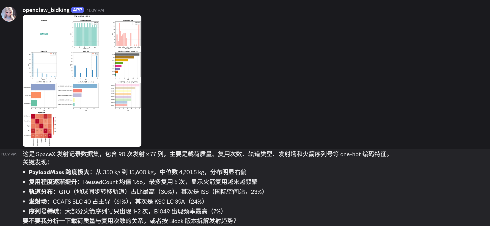
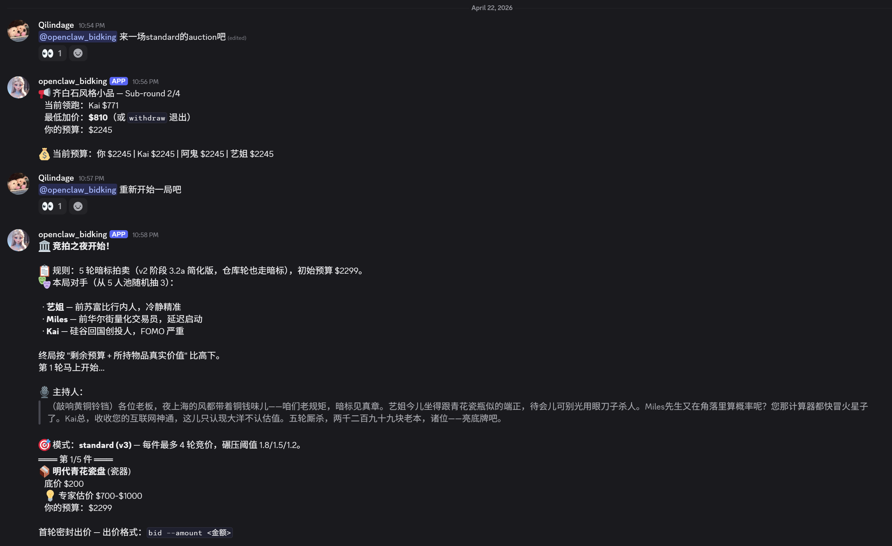
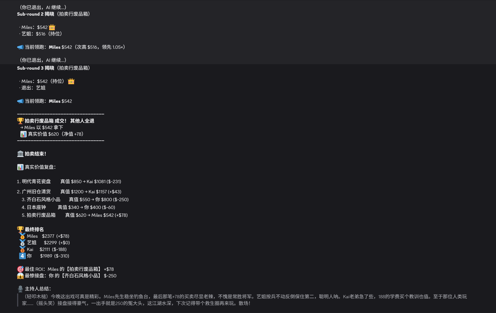

<p align="right">🌐 <a href="./README.md">English</a> · <strong>中文</strong></p>

# OpenClaw Discord Bot

> 架在 Discord 上的 AI 助手，基于 [OpenClaw](https://github.com/openclaw/openclaw) 框架。两个自研技能：**确定性 CSV 数据分析** 和 **带 AI 人设的竞价游戏**。

[](./LICENSE)
[](https://www.python.org/)
[](https://github.com/openclaw/openclaw)
[](https://platform.deepseek.com/)
[](https://discord.com/)

---

## Demo 演示

https://github.com/user-attachments/assets/d48fbde1-1160-4886-adc0-20be6bf00876

**▶ YouTube 链接：** [https://youtu.be/4KZbtfR2rOY](https://youtu.be/4KZbtfR2rOY)（unlisted）· **▶ 仓库内备份：** [`assets/videos/demo.mp4`](./assets/videos/demo.mp4)

### 截图

一局 Discord 会话里的三个关键瞬间——CSV 分析结果、游戏竞价进行中、最终排名。

<table>
<tr>
<td width="33%" align="center"><strong>1. CSV 分析</strong><br/></td>
<td width="33%" align="center"><strong>2. 游戏开局</strong><br/></td>
<td width="33%" align="center"><strong>3. 最终排名</strong><br/></td>
</tr>
</table>

> 🖼️ **完整未剪辑长图**（整局聊天流）→ [`04-full-chat-flow.png`](./assets/screenshots/04-full-chat-flow.png) —— 展示同一个 `@` 入口走两条技能路径，框架根据自然语言意图自动路由，用户没做任何"模式切换"操作。
>
> 📊 **其他数据集上的 EDA 样本图**（`csv_analyzer` 产出）→ [`eda-sample-1`](./assets/screenshots/eda-sample-1.webp) · [`eda-sample-2`](./assets/screenshots/eda-sample-2.webp)

---

## 能做什么

两个技能共享同一个 Discord 入口（`@<你的-bot> <任何话>`）。框架根据自然语言意图自动路由，无需手动切换模式。

### 1. `csv_analyzer` · 确定性 CSV / XLSX 分析

拖入任意表格文件，立刻得到：

- **10 面板 EDA 图**（PNG）：分布直方图（含均值/中位数标线）、相关性热图、缺失值概览、**自动识别 one-hot 编码分组**、每个面板多样化的 Seaborn 调色板、**中文字体自动 fallback**
- **结构化文本摘要**：行列数、dtype 分布、2-4 条关键发现

全流程确定性 Python —— 无 prompt 玄学。

### 2. `auction_king` · 多轮 AI 竞价游戏

- **5 个 AI 人设**（每局随机抽 3）：*稳健派老周头 · FOMO Kai · 知性艺姐 · 陷阱阿鬼 · 狙击手 Miles*
- **人设驱动决策**：阿鬼前抬后撤、Miles 前装睡后狙击、Kai 永远怕错过——**决策层面真的不同**，不只是台词换皮
- **台词层**（DeepSeek 驱动）：开场主持词 / 每轮 AI 反应 / 终局毒舌总结；API key 缺失时自动 fallback 到模板，不崩
- **双模式**：`quick`（v2 单轮暗标）和 `standard`（v3 多轮 + `withdraw` + 预算复用 + 流拍重拍）
- **状态机**：每回合持久化，session ID 可恢复；39 个单元测试覆盖出价逻辑和台词层

---

## 技术栈

- **Agent 框架**：[OpenClaw](https://github.com/openclaw/openclaw) 2026.4.15（TypeScript，npm 全局安装）
- **LLM**：[DeepSeek Chat](https://platform.deepseek.com/)（OpenAI 兼容接口）
- **Skill 逻辑**：Python 3.13 · `pandas` · `matplotlib` · `seaborn` · `openpyxl`
- **渠道**：Discord（bot 账号 OAuth2 邀请制，Message Content + Server Members intents）
- **宿主**：Windows 11 + PowerShell（Linux + macOS 的路径也能跑，skill 代码里没有任何 Windows 强依赖）

---

## 快速上手

完整 30 分钟可复刻流程 → **[SETUP.md](./SETUP.md)**；13 类真实踩坑 → **[TROUBLESHOOTING.md](./TROUBLESHOOTING.md)**。

```powershell
# 前置：Node.js 23+ · Python 3.13+ · Discord bot token · DeepSeek API key

# 1) 全局装 OpenClaw CLI
npm install -g openclaw

# 2) 持久化 env 变量（gateway 子进程要继承）
[Environment]::SetEnvironmentVariable("DEEPSEEK_API_KEY",     "sk-...", "User")
[Environment]::SetEnvironmentVariable("DISCORD_BOT_TOKEN",    "...",    "User")
[Environment]::SetEnvironmentVariable("AUCTION_KING_USE_LLM", "1",      "User")

# 3) 复制 openclaw.json 模板到 ~/.openclaw/（schema 见 SETUP.md）
openclaw config validate

# 4) 部署技能到 workspace（robocopy 同步）
.\tools\deploy-skill.ps1 csv_analyzer
.\tools\deploy-skill.ps1 auction_king

# 5) 前台启动 gateway
openclaw gateway

# 在 Discord 里：
#   @<你的-bot> 帮我分析      [拖 CSV 附件]   → EDA 图 + 摘要
#   @<你的-bot> 开一局 standard               → 开启竞价游戏
#   700                                      → 出价
#   withdraw                                 → 本子轮退出
```

---

## 项目叙事

我正在从 **EHS（环境健康安全）** 转向 **数据 / AI** 方向。这是我转型期第一份完整作品——不是照着教程复刻的，而是**真的做了架构决策、真的踩过 Windows 特定 bug、真的把权衡记录下来**的一段经历，全记在 [TROUBLESHOOTING.md](./TROUBLESHOOTING.md) 里。

几个代表性节点：

- **最早想走微信**—— ClawBot 插件仅支持 iOS，我用 Android，转 Discord。因为 OpenClaw 把 *channel* 和 *skill* 完全解耦，迁移期间 skill 代码一行没改。
- **绕开 OpenClaw 的 symlink-escape 安全机制**—— 框架拒绝通过 Windows junction 链接加载 workspace 外的 skill。用 `robocopy` 替代，封装进 [`tools/deploy-skill.ps1`](./tools/deploy-skill.ps1) 一条命令同步。
- **扒出 OpenClaw 2026.4.15 的 CRLF fence 解析 bug**—— `parseFenceSpans` 的 regex 没处理 `\r`，导致 SKILL.md 里写在 code fence 里的示例 path 被当真指令提取出来 → Discord 收到双发附件。修法：把字面 path 全换成占位符。已草拟一条上游 PR。
- **游戏类 skill 的 LLM 护栏拆成三条命名**—— 一条大的 "IRON RULE" 总会 collapse 成"啥都少说"，连带 paraphrase 掉我最想保留的 CLI 输出。拆成 *工具调用前的零字符 / 工具调用后的完整粘贴 / 出错时的一句问*，每条都配真实观察到的 ❌ 反例。修了 LLM alignment 过度泛化的问题。

这些都是一个工程师刚入职碰到陌生 agent 框架会踩的问题。做完、写清楚，就是我想被雇佣去做的工作。

---

## 进度

| 阶段 | 状态 |
|---|---|
| 1. 环境 + Discord bot 打通 | ✅ |
| 2. `csv_analyzer` 技能 | ✅ |
| 3. `auction_king` 技能（v2 quick + v3 standard）| ✅ |
| 4. 作品集化（视频 + 截图 + LinkedIn）| ✅ 完成 |

更细的分阶段 checklist → [PIVOT_TODO.md](./PIVOT_TODO.md)。

---

## 项目结构

```
openclaw-discord-bot/
├── README.md                   ← 英文版（默认入口）
├── README.zh-CN.md             ← 中文版（你在看）
├── SETUP.md                    ← 可复刻部署流程
├── TROUBLESHOOTING.md          ← 13 类真实踩坑
├── PIVOT_TODO.md               ← 转型 checklist
├── LICENSE                     ← MIT
├── requirements.txt            ← skill 的 Python 依赖
├── assets/
│   ├── screenshots/            ← 4 张 Discord 截图 + 2 张 EDA 样本
│   └── videos/demo.mp4         ← 15 秒 demo
├── tools/
│   └── deploy-skill.ps1        ← 一键部署 skill 到 ~/.openclaw/workspace/
└── skills/
    ├── csv_analyzer/           ← 确定性 EDA 技能
    │   ├── SKILL.md
    │   └── scripts/
    │       ├── analyze.py      ← pandas EDA（utf-8/gbk/latin-1 编码 fallback）
    │       └── plot.py         ← 多面板中文安全图表生成器
    └── auction_king/           ← 竞价游戏技能
        ├── GAME_DESIGN.md      ← v2 快速模式设计
        ├── GAME_DESIGN_v3.md   ← v3 多轮模式设计
        ├── SKILL.md            ← 4 条命名 LLM 护栏
        ├── data/items.json     ← 16 件单品 + 3 个仓库
        ├── scripts/            ← game.py + ai_bidders.py + llm_narrator.py + ...
        └── tests/              ← 39 个单元测试
```

---

## 文档地图

- 📺 **[assets/videos/demo.mp4](./assets/videos/demo.mp4)** · 15 秒 demo
- 🏗️ **[SETUP.md](./SETUP.md)** · 可复刻部署
- 📘 **[TROUBLESHOOTING.md](./TROUBLESHOOTING.md)** · 13 类真实踩坑
- 🎯 **[PIVOT_TODO.md](./PIVOT_TODO.md)** · 转型路线图
- 🎮 **[skills/auction_king/README.md](./skills/auction_king/README.md)** · 游戏设计与命令速查

---

## License

[MIT](./LICENSE) © 2026 SeasonCake
